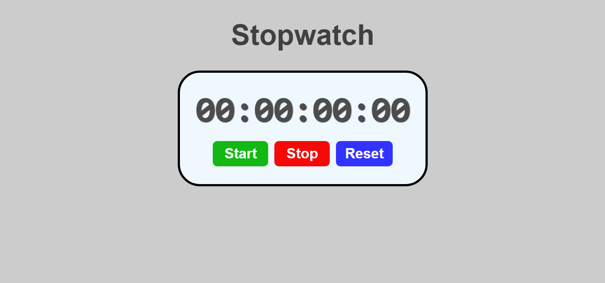

# Stopwatch Program

This is a simple stopwatch application built using HTML, CSS, and JavaScript. The application allows you to start, stop, and reset a timer that displays the elapsed time in hours, minutes, seconds, and milliseconds.


## 🌐 Live Demo

[View the live project here!](https://laibatariq110.github.io/Stopwatch-Program)

## Table of Contents

- [Features](#features)
- [Installation](#installation)
- [Usage](#usage)
- [Technologies Used](#technologies-used)
- [Contributing](#contributing)
- [License](#license)

## Features

- **Start**: Begins the stopwatch.
- **Stop**: Pauses the stopwatch and preserves the elapsed time.
- **Reset**: Resets the stopwatch to `00:00:00:00`.

## Installation

1. Clone the repository from GitHub:

    ```bash
    git clone https://github.com/laibatariq110/Stopwatch-Program.git
    ```

2. Navigate to the project folder:

    ```bash
    cd Stopwatch-Program
    ```

3. Open `index.html` in your web browser to view the stopwatch.

## Usage

- **Start Button**: Starts the stopwatch and begins tracking the time.
- **Stop Button**: Pauses the stopwatch, allowing you to stop the time at any point.
- **Reset Button**: Resets the stopwatch back to zero.

## Technologies Used

- **HTML**: Structure of the webpage.
- **CSS**: For styling the stopwatch and layout.
- **JavaScript**: Logic for running the stopwatch, including start, stop, reset, and updating the display in real time.

## Contributing

If you'd like to contribute to the project, feel free to fork the repository and submit a pull request. Suggestions and improvements are welcome!
